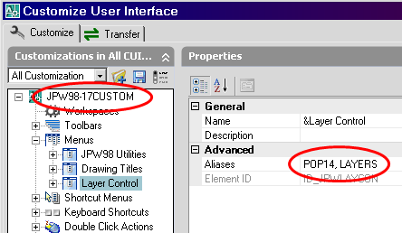

[How to control menus with AutoLISP:](https://knowledge.autodesk.com/search-result/caas/CloudHelp/cloudhelp/2015/ENU/AutoCAD-AutoLISP/files/GUID-92DA21E0-1E33-45AD-B2F8-1AB788392E4B-htm.html)

[More info (script example)](https://forums.autodesk.com/t5/visual-lisp-autolisp-and-general/lisp-pop-menu-control/td-p/4750583?nobounce)

[This explains brilliantly POP menus](https://forums.autodesk.com/t5/visual-lisp-autolisp-and-general/show-hide-menu-s-in-workspace/td-p/3662730)


I have a bunch of discipline specific menu files as partial cui's to my enterprise menu. I don't want to show them all, as some users may not need them all. What I would like to have is a menu item:
```
Load Menus ->
  Civil
  Electrical
  Mechanical
  Structural
```

and when they click on one of them the relevant menu file is made visible in the current workspace.

Is there a simple way to do this?

I saw this post, but the `menucmd` doesn't appear to be recognised command in 2012.

Thanks

---

Today is your lucky day as I am investigating this as we speak. `menucmd` does work in R2013 - I just tested this 2 days ago...

I am making the assumption you are meaning the **MENUBAR**, which is called a POP (`$Pn=`). If you are talking about the Screen Menu (`$S=`), the same will almost apply.

You will need to create a command, weather it is a line in a POP, a toolbar button, or an accelerator key. The format to this depends on how your menu is structured as explained below:

If you are going the Enterprise route, the following syntax is used: `Macro = $Pn=MyMenu.MyPop` where `n` is the position of the pop (valid numbers are 1 thru 16). However this will not work as one does not know how many POP's are currently showing, thus you do not know the position of the POP you want to replace.

`Macro = (menucmd "MainMenu.MainPop=+MyMenu.MyPop")` This will **insert and remove** a specific column of the POP where `MainMenu.MainPop` is a POP that is named anything from POP1 thru POP16 as these will show when first starting.

To simply add a POP, where none exists (you are adding, not replacing), the following can be used: `Macro = (menucmd "P16=+MyMenu.MyPop")` This assures the new POP is added as the last item in the **MENUBAR**. Please note that this will not be assigned as POP16 if there are less than 15 POP's currently showing.


Now be aware that if you decide to transfer the enterprise menus into the main, as one big menu, this geometry will have to be revised to reflect the main menu group name. An alternative is to remove the menu group name prefix from the statement `(menucmd "P16=+MyPop")`.

Now the fun part.

Civil - Assign an Alias as `POP100` (mandatory), and Alias `Civil` where POP menu name. Assign a Menu Group name of `My_Civil` (you can use the actual file name here). Electrical - Alias as `POP200` and `Electrical`. Menu Group name is `My_Electrical`. Anything above POP16 to POP999 can be used, and will not display when editor is started.

Using what is shown above to **insert** the civil POP:
```lisp
(menucmd "P16=+My_Civil.POP100")
; or
(menucmd "P16=+My_Civil.Civil")
```

Using what is shown above to **insert and remove**:

```lisp
(menucmd "My_Civil.POP100=+My_Electrical.POP200")
```

To **remove** a POP, use this:

```lisp
(menucmd "My_Electrical.POP200=-")
```

To make command line quiet, you can try to add a ^P in front of the macro:

```lisp
Macro = ^P(menucmd "My_Electrical.POP200=-")
```
NOTE: untested, I never had a use for this until now




For this example, this menu is an enterprise to the main ACAD.cui. `POP14` will show when the editor is started, however if I name this to POP140, it will not show and I will use the following macro to make it display:
```lisp
(menucmd "P16=+JPW98-17CUSTOM.LAYERS")
```

Lastly, one can create a "home" POP that will list all your enterprise POP's. This column will show when editor is started and then you can use the insert and remove method to display desired menu in it's place. Go into each POP (civil, elect, etc.) and add a line either at the top or botton (next to a separator) that will reset back to the "Home" POP.

Of course this is untested as I have been tinkering and studying this topic for about a week now. See AutoCAD's Developers Guide -> Customize the User Interface -> Create Pull-Down and Shortcut Menus for more information.


If you need Screen Menu help, including page swapping and layering, I'll get you there as well.

Scot-65
